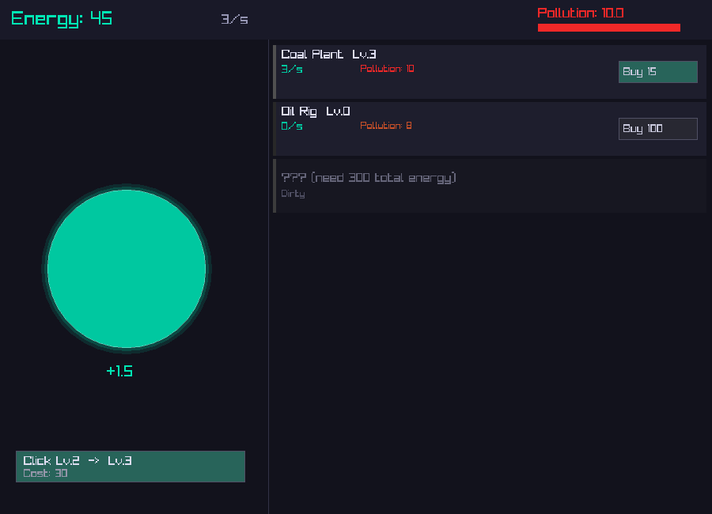
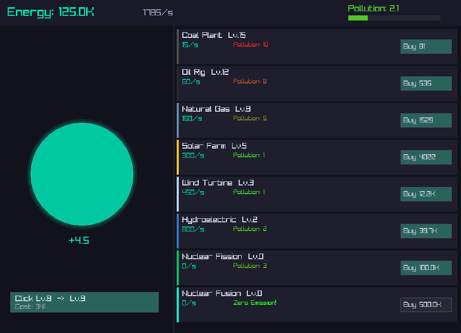

# Energy Clicker

An idle/clicker game built with [raylib](https://www.raylib.com/) (Python bindings). Inspired by Adventure Capitalist, but with an energy production theme — start dirty, go clean.

## Screenshots

### Early Game
You begin with coal, clicking your way through smog.



### Mid Game
Diversify into renewables and watch your pollution drop.



## How to Play

**Click** the big green button to generate energy manually. Use that energy to buy and upgrade power sources on the right panel.

### Energy Sources

| Source | Base Power | Pollution | Unlock Cost |
|---|---|---|---|
| Coal Plant | 1/s | 10 (Very Dirty) | Free |
| Oil Rig | 5/s | 8 (Very Dirty) | 50 |
| Natural Gas | 20/s | 5 (Dirty) | 300 |
| Solar Farm | 60/s | 1 (Clean) | 1,500 |
| Wind Turbine | 150/s | 1 (Clean) | 6,000 |
| Hydroelectric | 400/s | 2 (Moderate) | 25,000 |
| Nuclear Fission | 1,200/s | 3 (Moderate) | 80,000 |
| Nuclear Fusion | 5,000/s | 0 (Zero Emission) | 400,000 |

- Each level of a source increases its energy output
- Costs scale by 1.15x per level
- The **pollution meter** shows your weighted average — invest in clean energy to bring it down
- **Upgrade your click power** with the button at the bottom-left

### Goal

Build an energy empire that's both powerful and clean. The ultimate achievement is running entirely on Nuclear Fusion with zero pollution.

## Project Structure

```
raylib_clicker/
├── main.py              # Entry point: window, audio, input, game loop
├── game.py              # Game state and logic (no graphics dependencies)
├── draw.py              # All rendering code (raylib drawing functions)
├── data/
│   └── sources.json     # Energy source definitions (balance, costs, pollution)
├── assets/
│   └── ambient.mp3      # Background music
├── screenshot.py        # Utility to generate README screenshots
└── screenshots/         # README images
```

- **`game.py`** is fully independent of raylib — pure Python game logic that could be reused with any renderer
- **`draw.py`** handles all rendering and layout constants
- **`data/sources.json`** lets you tweak game balance (add sources, change costs/pollution) without touching code

## Install & Run

```bash
pip install raylib
python main.py
```

Requires Python 3.8+ and a desktop environment with OpenGL support.

## Credits

- **Ambient Music**: "Mysterious Ambience (song21)" by [pixelsphere.org](https://pixelsphere.org) — [OpenGameArt](https://opengameart.org/content/mysterious-ambience-song21) (CC0 / Public Domain)
